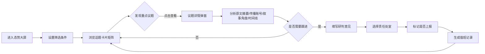

## 1. 产品概述

面向省级外宣和舆情值班人员的 Web 态势总览大屏，通过一张大屏清晰展示境外媒体、社交平台和智库网站对重点议题的讨论变化。产品强调专业稳重，适用于每日早晚班交接、重大活动期间滚动监看和领导临时询问时快速定位关键信息。

## 2. 核心功能

### 2.1 用户角色

| 角色 | 描述 | 核心权限 |
|------|------|----------|
| 值班人员 | 省级外宣和舆情值班人员 | 浏览议题看板、查看议题详情、填写处置记录 |
| 值班班长 | 值班负责人 | 上述所有 + 审核上报、管理值班记录 |

### 2.2 功能模块

1. **议题看板页**：筛选条件、话题卡片矩阵、热度排行、趋势标识
2. **议题详情弹窗**：原文摘要、传播账号、叙事角度、关联事件时间线
3. **处置记录模块**：研判意见表单、值班记录列表、上报状态

### 2.3 页面详情

| 页面名称 | 模块名称 | 功能描述 |
|-----------|-------------|---------------------|
| 议题看板页 | 顶部筛选栏 | 国家地区选择、语种选择、时间范围选择、重置按钮 |
| 议题看板页 | 数据概览区 | 总议题数、升温议题数、高风险议题数、媒体来源数 |
| 议题看板页 | 话题卡片矩阵 | 按热度、增速、负面占比展示，带趋势标识（升温/平稳/回落） |
| 议题看板页 | 风险分级图例 | 高/中/低风险等级标识说明 |
| 议题详情弹窗 | 基础信息区 | 议题标题、热度值、风险等级、趋势、主要来源 |
| 议题详情弹窗 | 原文摘要 | 代表性原文摘要列表，支持展开查看 |
| 议题详情弹窗 | 传播账号 | 主要传播账号排名，含粉丝量、发布量 |
| 议题详情弹窗 | 叙事角度 | 常见叙事角度分类及占比 |
| 议题详情弹窗 | 关联事件时间线 | 关键事件时间轴展示 |
| 处置记录模块 | 研判表单 | 研判意见输入、责任处室选择、是否上报开关 |
| 处置记录模块 | 值班记录列表 | 历史值班记录，按时间倒序 |

## 3. 核心流程

值班人员登录系统
选择筛选条件（国家地区、语种、时间范围）
浏览话题卡片矩阵，识别重点议题
点击高热度/升温议题，查看详情
分析原文摘要、传播账号、叙事角度、时间线
确认需要跟进时，填写研判意见
选择责任处室，标记是否上报
系统自动生成值班记录
完成交接班时查看历史记录

## 4. 用户界面设计

### 4.1 设计风格

- **主色调**：深海蓝（#0A1628）为背景主色，搭配政务蓝（#1E40AF）为主强调色
- **辅助色**：升温红（#EF4444）高风险、警示黄（#F59E0B）中风险、平稳绿（#10B981）低风险
- **中性色**：深灰、中灰、浅灰多层次灰阶，确保专业稳重感
- **按钮风格**：直角微圆角（4px），扁平化设计，悬停有微动效
- **字体**：中文使用 "Noto Sans SC"，数字使用 "JetBrains Mono" 等宽字体，保证数据可读性
- **布局风格**：卡片式布局，网格化排列，信息层次分明
- **图标风格**：线性图标，统一 2px 线条，简洁专业

### 4.2 页面设计概述

| 页面名称 | 模块名称 | UI 风格 |
|-----------|-------------|----------|
| 议题看板页 | 顶部筛选栏 | 深色背景，蓝色强调，下拉选择器，时间选择器 |
| 议题看板页 | 数据概览区 | 四个数据卡片，大数字展示，带趋势箭头 |
| 议题看板页 | 话题卡片矩阵 | 网格布局，卡片悬停上浮，风险等级色条标识 |
| 议题详情弹窗 | 整体 | 右侧滑出式弹窗，深色半透明遮罩 |
| 议题详情弹窗 | 内容分区 | 标签页切换，内容区滚动 |
| 处置记录模块 | 表单区 | 左侧表单，右侧记录列表 |
| 处置记录模块 | 记录列表 | 时间线式记录，状态标签 |

### 4.3 响应式

- 桌面端优先设计，适配 1920×1080 及以上大屏
- 支持 1366×768 最低分辨率
- 不做移动端适配，专注大屏展示场景

### 4.4 动效设计

- 页面加载：数据卡片渐入 + 数字滚动动画
- 卡片悬停：轻微上浮 + 阴影加深
- 弹窗：右侧滑入 + 背景模糊
- 数据更新：数字过渡动画
- 趋势标识：呼吸灯效（仅高风险议题）
