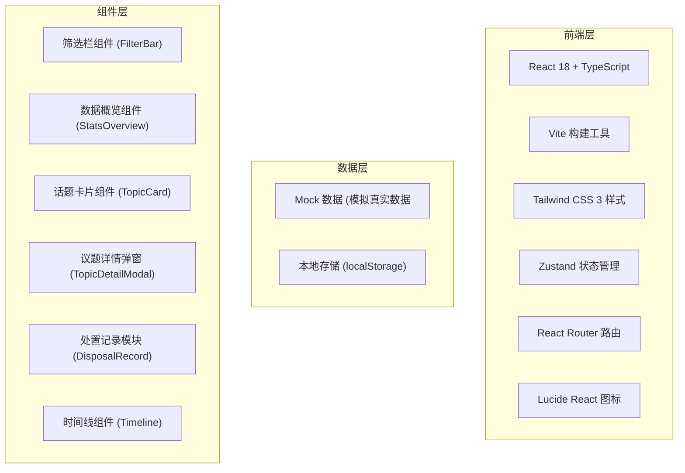
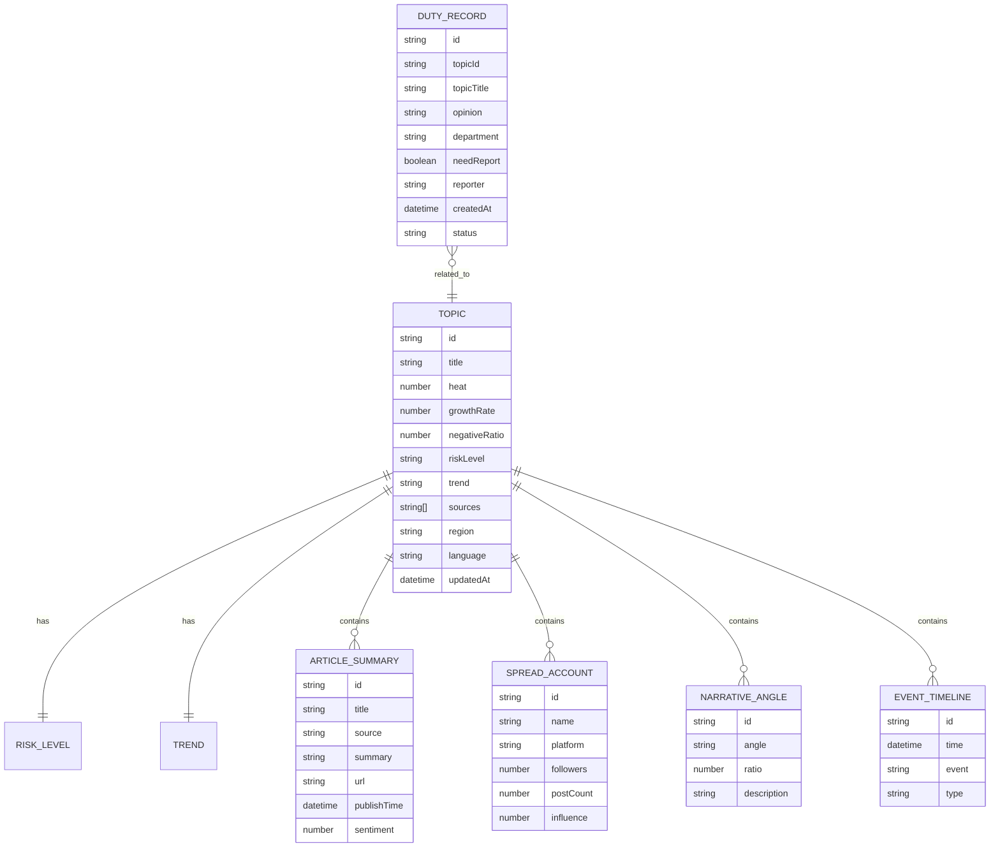

## 1. 架构设计



## 2. 技术说明

- **前端框架**：React@18 + TypeScript + Vite@5
- **样式方案**：Tailwind CSS@3
- **状态管理**：Zustand
- **路由管理**：react-router-dom@6
- **图标库**：lucide-react
- **数据来源**：Mock 数据（前端模拟），无后端
- **数据持久化**：localStorage 存储值班记录

## 3. 路由定义

| 路由 | 用途 |
|-------|---------|
| / | 态势总览主页（议题看板 + 处置记录） |

## 4. 数据模型

### 4.1 数据模型定义



### 4.2 类型定义

```typescript
// 风险等级
type RiskLevel = 'high' | 'medium' | 'low';

// 趋势类型
type TrendType = 'rising' | 'stable' | 'falling';

// 议题
interface Topic {
  id: string;
  title: string;
  heat: number;
  growthRate: number;
  negativeRatio: number;
  riskLevel: RiskLevel;
  trend: TrendType;
  sources: string[];
  region: string;
  language: string;
  updatedAt: Date;
  articleSummaries: ArticleSummary[];
  spreadAccounts: SpreadAccount[];
  narrativeAngles: NarrativeAngle[];
  eventTimeline: TimelineEvent[];
}

// 原文摘要
interface ArticleSummary {
  id: string;
  title: string;
  source: string;
  summary: string;
  url: string;
  publishTime: Date;
  sentiment: number;
}

// 传播账号
interface SpreadAccount {
  id: string;
  name: string;
  platform: string;
  followers: number;
  postCount: number;
  influence: number;
}

// 叙事角度
interface NarrativeAngle {
  id: string;
  angle: string;
  ratio: number;
  description: string;
}

// 时间线事件
interface TimelineEvent {
  id: string;
  time: Date;
  event: string;
  type: 'media' | 'social' | 'official';
}

// 值班记录
interface DutyRecord {
  id: string;
  topicId: string;
  topicTitle: string;
  opinion: string;
  department: string;
  needReport: boolean;
  reporter: string;
  createdAt: Date;
  status: 'pending' | 'processing' | 'completed';
}

// 筛选条件
interface FilterParams {
  region: string;
  language: string;
  timeRange: string;
}
```

## 5. 项目结构

```
src/
├── components/
│   ├── FilterBar.tsx          # 筛选栏组件
│   ├── StatsOverview.tsx   # 数据概览组件
│   ├── TopicCard.tsx       # 话题卡片组件
│   ├── TopicGrid.tsx       # 话题卡片网格
│   ├── TopicDetailModal/   # 议题详情弹窗
│   │   ├── index.tsx
│   │   ├── ArticleList.tsx   # 原文摘要列表
│   │   ├── AccountList.tsx # 传播账号列表
│   │   ├── NarrativeSection.tsx # 叙事角度
│   │   └── TimelineSection.tsx # 时间线
│   ├── DisposalRecord/    # 处置记录模块
│   │   ├── index.tsx
│   │   ├── OpinionForm.tsx # 研判意见表单
│   │   └── RecordList.tsx  # 值班记录列表
│   └── ui/                 # 通用UI组件
│       ├── Badge.tsx
│       ├── TrendIcon.tsx
│       └── RiskBadge.tsx
├── pages/
│   └── Dashboard.tsx       # 主页面
├── store/
│   └── useStore.ts         # Zustand 状态管理
├── data/
│   └── mockData.ts         # Mock 数据
├── types/
│   └── index.ts            # 类型定义
├── utils/
│   └── format.ts            # 工具函数
├── App.tsx
├── main.tsx
└── index.css
```

## 6. 状态管理设计

使用 Zustand 管理全局状态：

- `topics`: 议题列表数据
- `selectedTopic`: 当前选中的议题
- `filterParams`: 筛选条件
- `dutyRecords`: 值班记录列表
- `isDetailModalOpen`: 详情弹窗开关状态

## 7. 关键技术要点

1. **大屏适配**：使用 CSS 变量 + rem 单位适配不同分辨率
2. **数据可视化**：纯 CSS + 图标展示，避免引入过重的图表库，保持轻量
3. **动效性能**：使用 CSS transition/transform 实现动画，避免重排重绘
4. **交互体验**：键盘快捷键支持（ESC 关闭弹窗）
5. **数据刷新**：模拟定时刷新机制，模拟真实舆情更新
